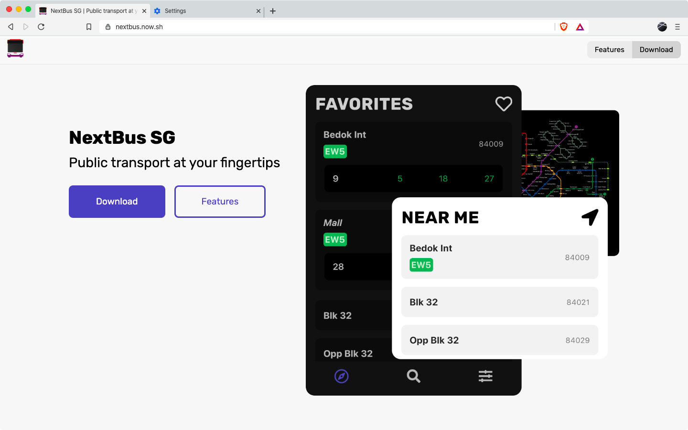

# [NextBusSG website](https://nextbus.now.sh/)

> Promotional website for the NextBus SG iOS and Android app.

[](https://github.com/themindstorm/NextBusSG)

[](http://makeapullrequest.com)


<a href='https://apps.apple.com/my/app/nextbus-sg/id1509167028'></a>
<a href='https://play.google.com/store/apps/details?id=com.themindstorm.nextbussg&pcampaignid=pcampaignidMKT-Other-global-all-co-prtnr-py-PartBadge-Mar2515-1'></a>

Check out the repository for the app at [themindstorm/NextBusSG](https://github.com/themindstorm/NextBusSG).

## Gallery


## Build Setup

```bash
# install dependencies
npm i

# serve with hot reload at localhost:3000
$ npm run dev
```

If you've never used Nuxt, check out [the docs](https://nuxtjs.org).
